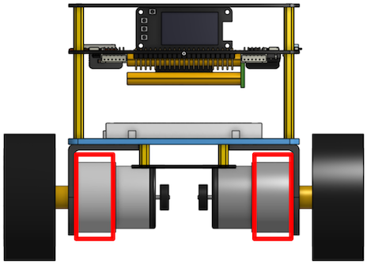
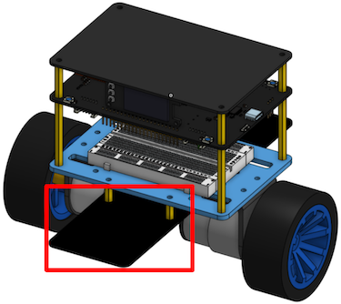
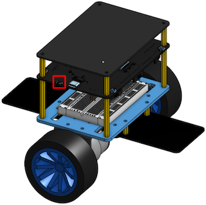
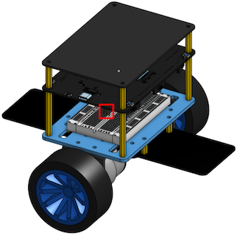
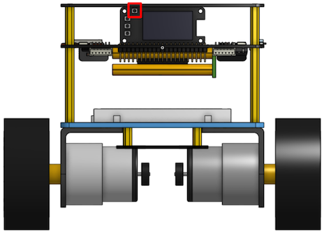
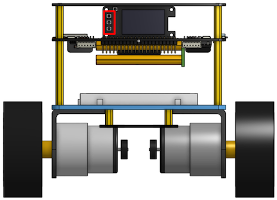
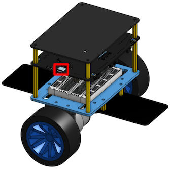
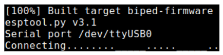
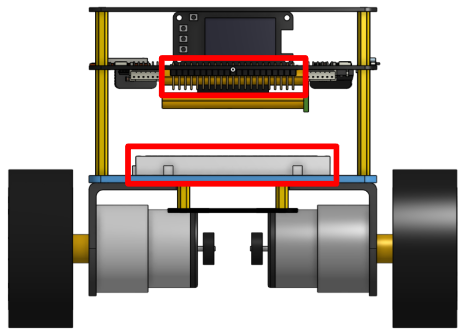

## Biped

## Table of Contents

1. [Overview](#overview)
2. [Handling the Biped](#handling-the-biped)
3. [Buttons and Switches](#buttons-and-switches)
4. [Flashing the Biped](#flashing-the-biped)
5. [Expansion Header and Breadboard](#expansion-header-and-breadboard)

## Overview

Biped (pronounced bai-ped) is a custom two-wheeled self-balancing system designed and built by the CS 431 course staff. Definition of biped: an animal that uses two legs for walking.

## Handling the Biped

1. Safely and securely hold the Biped by the gearbox of one of its motors, or by either side of the balancing paddle.
2. Refrain from grabbing the Biped by its upper chassis or wheels.
   - Holding the Biped by the upper chassis may place your fingers dangerously close to the electronic components.
   - The wheels are not designed to support the weight of the Biped.
3. Avoid contact with the electronic components on the Biped.
   - Electrostatic discharge (ESD) from your hands can damage the onboard components.
4. Keep all metal objects away from the Biped to prevent shorts.
   - Small metal items can inadvertently bridge connections, leading to potential short circuits.
5. Do not remove Biped from the lab under any circumstances.
   - Remember, students have 24/7 access to the lab.
6. Conduct balancing experiments with the Biped on the ground.
   - Operating the Biped on a table risks having it falling off due to faults or bugs.
7. Place the Biped upside down on the center table when done.
   - Centralized storage helps us better track and manage the Bipeds.
8. Handle with extreme care, and DO NOT DROP THE BIPED!
   - Wheels are made of plastic and can break easily if dropped.
   - Biped is custom-made. Therefore, replacements are difficult and costly.
   - Be aware that any damage incurred will result in automatic charges to the responsible student’s account.

## Buttons and Switches

### Power Switch

This is the main power switch of the Biped.
- On position: flip the switch towards the USB-C port.
- Off position: flip the switch away from the USB-C port.
- Power indicator: when the Biped is powered on, the green LED on the U12 module (MPU6050) will illuminate.

### Motor Jumper

The motor jumper turns the motor voltage regulator on and off.
- On position: place the jumper on the two pins away from the USB-C port.
- Off position: place the jumper on the two pins towards the USB-C port.
- Unplugging the motor jumper disables the motors altogether, regardless of any software commands.
- Place the motor jumper in the off position during normal operations.
- Be careful not to lose the motor jumper!

### Reset Button

The reset button initiates a soft reset of the Biped.
- Pressing the reset button restarts all hardware and software components without the need to toggle the main power switch.

### Push Buttons

The Biped features three programmable push buttons, labeled A, B, and C, arranged from top to bottom.
- The push buttons are connected to I/O expander A (U4).
- In Lab 4, you will develop a custom interrupt service framework to handle interrupts from these push buttons.

## Flashing the Biped

1. Follow the lab instructions to flash the Biped.
   - Ensure the USB-C cable is securely connected to the Biped.
2. What should I do if our Biped doesn’t flash?
   - Try cycling the power switch during the flashing progress bar.
Contact the TA for further assistance if the issue persists.
3. Avoid moving the Biped while the USB-C cable is connected.
   - Be aware of the cable’s presence to protect the USB-C connector.
4. Always place the Biped upside down on the table before flashing.
   - Bugs in your firmware might cause unintended motor activation.

## Expansion Header and Breadboard

1. Do not attempt to hotwire the expansion headers.
   - Shorting the power rails can result in catastrophic damages.
2. Use only the Dupont cables provided by the TA for connections to the expansion header.
   - Contact the TA for a hardware expansion kit for 4-credit projects.
3. Always consult with the TA before using the expansion header.
   - The TA will perform a hardware test on the expansion header for safety.
4. The breadboard on the Biped is removable and reattachable.
   - Exercise caution when handling the breadboard, especially near the battery and its connector cable located above the breadboard.
