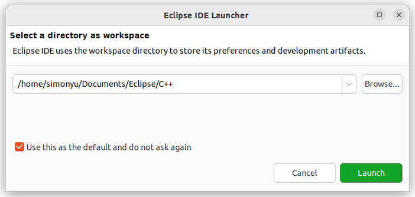

## Eclipse

## Table of Contents

1. [Overview](#overview)
2. [Setting Up](#setting-up)
3. [Terminal](#terminal)
4. [Searching](#searching)
5. [Formatter](#formatter)
6. [Indexer](#indexer)
7. [Shortcuts](#shortcuts)

## Overview

Eclipse is a versatile and open-source integrated development environment (IDE) that caters to the needs of embedded software developers. With a robust set of features, Eclipse provides a unified platform for coding, debugging, and deploying software for embedded systems. Supporting various programming languages and equipped with extensive plugins, Eclipse enhances development efficiency. Its flexibility, coupled with a vibrant community, makes it an ideal choice for embedded software development.

## Setting Up

### Workspace

On the lab workstation, create an Eclipse C++ workspace directory under your home document directory as follows:
```bash
mkdir -pv ~/Documents/Eclipse/C++
```

Launch Eclipse. Upon its first launch, Eclipse will prompt the user to select a directory as workspace. Select the Eclipse C++ workspace directory created above, check `Use this as the default and do not ask again`, and click `Launch`.



### Tabs

Eclipse will display a `Welcome` tab upon its first launch. Close the `Welcome` tab by clicking the `X` in the tab.


The default Eclipse window view includes three side tabs on the right, `Outline`, `Task List`, and `Build Target` tabs. Close all three tabs by clicking the `X` in the tabs.


Add the `Terminal` tab by clicking the `Window` menu on the top. In the `Window` menu, select `Show View`, and then `Terminal`. The `Terminal` is useful for accessing local terminals, as well as serial terminals with Biped. Refer to [Terminal](#terminal) below for more details.

Add the `Search` tab by clicking the `Window` menu on the top. In the `Window` menu, select `Show View`, and then `Search`. The `Search` is useful for displaying project-wise search results. Refer to [Searching](#searching) below for more details.

Additionally, add the `Progress` tab by clicking the `Window` menu on the top. In the `Window` menu, select `Show View`, and then `Other...`. In the search bar, search for `Progress`, and then select `Progress` from under `General`. The `Progress` is useful for monitoring any ongoing tasks performed by Eclipse.

The newly added tabs are visible at the bottom of the window.


### Dark Mode

To protect our precious eyes, set the UI to dark mode by clicking the `Window` menu on the top. In the `Window` menu, select `Preferences`, expand `General` on the left, and then click `Appearance` under `General`. For the `Theme` option on the right, select `Dark`. Then, click `Apply and Close` at the bottom. Click `Restart` if prompted.


### Import Projects

Before proceeding, first complete `Setting Up the Project` in the project [README](../../../../../README.md#setting-up-the-project).


After setting up the project, in Eclipse, click `Import projects...` under the `Project Explorer` tab. Then, expand `General`, choose `Existing Projects into Workspace` under `General`, and then click `Next>` at the bottom. In the next menu, click `Browse...` to the right of the `Select root directory:` option, and then navigate to the project build directory `~/Documents/Projects/biped-firmware/build/biped-firmware`. Click `Open`, leave all other options as default, and then click `Finish`.

Note: the project build directory is created upon the completion of `Setting Up the Project` in the project [README](../../../../../README.md#setting-up-the-project).


### Project Explorer

After importing the project, expand `biped-firmware-Release@...` under the `Project Explorer` tab, and then expand `[Source directory]` under `biped-firmware-Release@...`. From this point on, all development should be done under `[Source directory]`, and all other entries under `biped-firmware-Release@...` should be ignored. Furthermore, click the yellow double-arrow icon right below the `Project Explorer` tab to link the `Project Explorer` with the editor.


### Formatter

Eclipse provides a code formatter, ensuring a uniform and consistent code style across all project files.

Configure the formatter by clicking the `Window` menu on the top. In the `Window` menu, select `Preferences`, expand `C/C++` on the left, then expand `Code Style` under `C/C++`, and then click `Formatter`. On the right, click `Import...`, and then navigate to the file `~/Documents/Projects/biped-firmware/configs/eclipse/format_cpp.xml`. Click `Open` and then click `Apply and Close`. Refer to [Formatter](#formatter) below for more details.


## Terminal

The `Terminal` tab can be used to access local terminals. To open a local terminal, select the `Terminal` tab at the bottom of the window and then click the leftmost monitor icon. Then, select `Local Terminal` and click `OK`. A fully functional local terminal subtab is now created under the `Terminal` tab.


The `Terminal` tab can be used to access serial terminals with Biped. First, connect the USB-C cable with Biped and make sure Biped is powered on. To open a serial terminal, select the `Terminal` tab at the bottom of the window and then click the leftmost monitor icon. Then, select `Serial Terminal`, leave all options as default, and click `OK`. A serial terminal subtab is now created under the `Terminal` tab, and any serial prints from Biped should be displayed under the serial terminal subtab.

Note: it is important to close any serial terminal before flashing the Biped. Otherwise, bytes written by the ESP-IDF framework intended for Biped will be intercepted by the serial terminal. Additionally, it is important to close any serial terminal before disconnecting or connecting any Biped. The operator system attaches Biped as `/dev/ttyUSB0` by default, only if `/dev/ttyUSB0` is unused. If an open serial terminal is using `/dev/ttyUSB0`, disconnected Biped will not free `/dev/ttyUSB0`. Reconnecting Biped will force the operating system to attach it as `/dev/ttyUSB1` instead, as `/dev/ttyUSB0` is still used by the open serial terminal. Disconnecting Biped, closing all serial terminals, and reconnecting Biped will make the operating system attach it as `/dev/ttyUSB0` once again.


## Searching

Searching within the current file can be done using Ctrl-F. Project-wise searching can be done by clicking the `Search` menu on the top. In the `Search` menu, select `File...`. Enter the text to be searched in the `Containing text:`, leave all other options as default, and click `Search`. The project-wise search results are displayed in the `Search` tab at the bottom of the window.


## Formatter

The formatter can be invoked in the current file using Ctrl-Shift-F. Upon first use, the formatter will prompt the user to select the formatting scope. Leave the option as `The entire file`, check `Remember this choice and do not ask again`, and then click `OK`. Remember to format your code regularly using Ctrl-Shift-F during your firmware development process.


## Indexer

Eclipse also provides a code indexer, which accelerates code navigation and analysis with a strong index of the entire codebase together with any external dependencies.

The indexer database is built upon the import of the project. However, indexer database may need to be rebuilt due to rapid or significant changes in the codebase, which may induce `... could not be resolved` errors. In this case, rebuild the indexer database by clicking the `Project` menu on the top. In the `Project` menu, select `C/C++ Index`, and then `Rebuild`. The indexer database building progress can be viewed by selecting the `Progress` tab at the bottom of the window.


## Shortcuts

Eclipse provides a variety of useful keyboard and mouse shortcuts that facilitate the development process as follows:
- Ctrl-B: build the project.
- Ctrl-Click: go to the definition of the current term.
- Ctrl-D: delete the selected line(s).
- Ctrl-Down: move down the selected line(s).
- Ctrl-F: search within the current file.
- Ctrl-Shift-F: format the current file.
- Ctrl-Shift-N: add the include statement for the current term.
- Ctrl-Shift-/: collapse all code blocks (/ in the numpad).
- Ctrl-Shift-*: expand all code blocks (\* in the numpad).
- Ctrl-Space: show parsing-based proposals for the current partially typed term.
- Ctrl-Tab: switch between header and source files.
- Ctrl-Up: move up the selected line(s).
- Ctrl-/: comment or uncomment the selected line(s).
